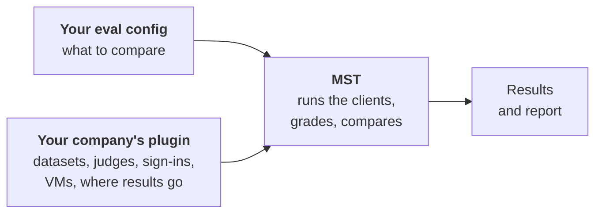
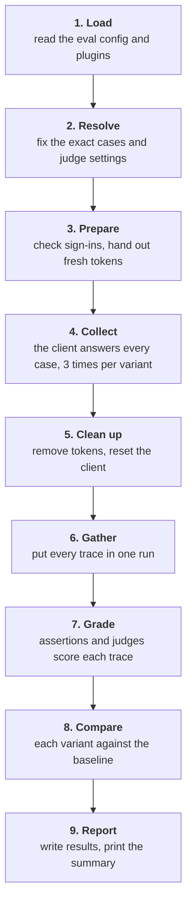
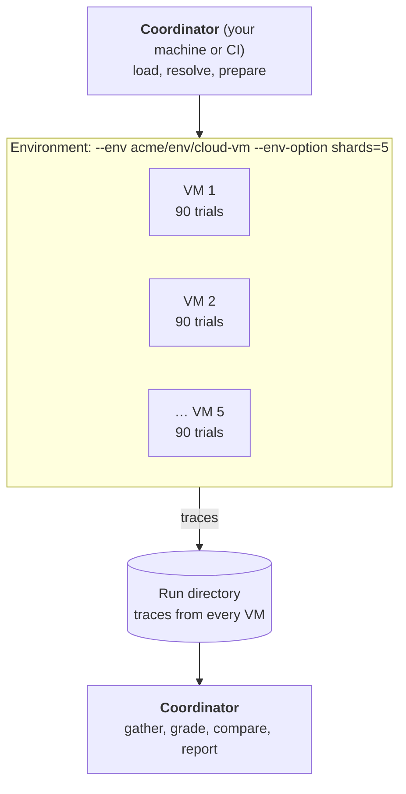

# How MST evals work

> **Design proposal.** This is the companion to the [walkthrough](./README.md). The walkthrough shows _what_ you type. This page explains _what happens_ when you type it, and _why_ it works that way. Some of it is built and some isn't; [What's built](#whats-built-and-whats-planned) at the end keeps track.

It assumes you know roughly what an MCP server is: a service that gives an AI application tools to call, such as "search Slack" or "create a Jira issue". It doesn't assume anything else.

## The problem

Say you run an MCP server and have rewritten its tool descriptions. You want to know whether Cowork (Anthropic's desktop assistant) picks the right tools and gives better answers with the new descriptions than with the current ones.

Asking Cowork one question and reading the answer won't tell you much:

- **The same question gets different answers.** The model behind Cowork isn't deterministic. One good answer could be luck.
- **One question isn't representative.** You need dozens of realistic questions, each with a known good answer.
- **"Better" needs a consistent judge.** Reading 450 answers by hand isn't practical, and it isn't consistent either. An LLM can grade them, but it has to grade every answer the same way.
- **The comparison has to be fair.** Every setup needs the same questions, the same model, the same client and the same servers, with only the tool descriptions changed.
- **Real clients are desktop apps.** Cowork has to be driven like a person would drive it, on a Mac or a Linux VM. That's slow, so a full run takes an hour or more.
- **Your data and credentials are yours.** The questions, the grading rules and the logins are specific to your company and can't live in an open-source tool.

MST handles all of this. You describe the comparison in one file, and MST runs it, grades it and tells you what changed.

## Terms

These terms are used throughout this page and the walkthrough. The full glossary is in [`CONTEXT.md`](../../CONTEXT.md).

**What you're testing**

| Term         | Meaning                                                                                                                                       | In the walkthrough                        |
| ------------ | --------------------------------------------------------------------------------------------------------------------------------------------- | ----------------------------------------- |
| **Client**   | The AI application under test. MST drives it the way a user would.                                                                            | `cowork`                                  |
| **Model**    | The LLM the client uses.                                                                                                                      | `claude-opus-4-8`                         |
| **Server**   | An MCP server the client can call tools on.                                                                                                   | `acme`, `slack`, `github`                 |
| **Variant**  | One setup being tested: a client, a model, a set of servers and the tool descriptions the client sees. Every variant gets the same questions. | `current`, `rewritten`, `rewritten-terse` |
| **Baseline** | The variant the others are compared against. The first one, unless you say otherwise.                                                         | `current`                                 |

**What you're testing with**

| Term            | Meaning                                                                                                  | In the walkthrough                               |
| --------------- | -------------------------------------------------------------------------------------------------------- | ------------------------------------------------ |
| **Case**        | One question for the client (the **input**) and what a good result looks like (the **expected** answer). | `e2e-0011`: "What is the process for reporting…" |
| **Dataset**     | A named list of cases.                                                                                   | `acme/dataset/info-seeking` (50 cases)           |
| **Eval**        | Everything about one comparison: datasets, variants, how to grade, what to measure.                      | —                                                |
| **Eval config** | The JSON file that defines one eval.                                                                     | `evals/cowork-tool-descriptions.json`            |

**What happens during a run**

| Term      | Meaning                                                                                                              | In the walkthrough                                      |
| --------- | -------------------------------------------------------------------------------------------------------------------- | ------------------------------------------------------- |
| **Trial** | One attempt at one case by one variant. Each case runs several trials, because answers vary.                         | `"trials": 3`                                           |
| **Trace** | The record of one trial: every tool call (server, tool, arguments, result), the final answer, tokens, cost and time. | `traces/rewritten/e2e-0011/2.json`                      |
| **Run**   | One execution of an eval: every variant on every case, for every trial. It has a **run ID**.                         | `7f3c2a`: 50 cases × 3 variants × 3 trials = 450 trials |

**How answers are graded**

| Term               | Meaning                                                                                                                                             | In the walkthrough               |
| ------------------ | --------------------------------------------------------------------------------------------------------------------------------------------------- | -------------------------------- |
| **Grader**         | Anything that grades a trial: an assertion or a judge.                                                                                              | —                                |
| **Assertion**      | A grader written in code. It's deterministic and costs nothing, for example "the client called a search tool".                                      | —                                |
| **Judge**          | A grader that is an LLM. It reads the trial and the expected answer and gives a **score**: 0 to 1, pass or fail, and why.                           | `acme/judge/correctness`         |
| **Pairwise judge** | A judge that reads two variants' trials of the same case and gives a **preference**: which is better, by how much, and why.                         | `acme/pairwise-judge/preference` |
| **Comparison**     | How each variant differs from the baseline: metric changes, whether each change is better, worse or unclear, and which cases improved or regressed. | The table at the end of a run    |

**How MST is extended**

| Term                 | Meaning                                                                                                                                 | In the walkthrough                                       |
| -------------------- | --------------------------------------------------------------------------------------------------------------------------------------- | -------------------------------------------------------- |
| **Plugin**           | A package that adds things to MST, all under one **namespace**.                                                                         | `@acme/mst-plugin`, namespace `acme`                     |
| **Extension**        | One thing a plugin adds, of a given **kind**: a dataset, a judge, a connector, an environment, a result store, …                        | `acme/judge/correctness` is an extension of kind `judge` |
| **Connector**        | An extension that describes one MCP server: its URL, how to sign in, and optionally a proxy in front of it.                             | `acme/connector/slack`                                   |
| **Credential store** | Where long-lived sign-ins (refresh grants) are kept, so runs can get fresh tokens without a browser.                                    | `acme/credential-store/secret-manager`                   |
| **Environment**      | Where the client runs: your machine, containers on it, or VMs. Each machine runs one **shard** of the trials.                           | `local`, `docker` (planned), `acme/env/cloud-vm`         |
| **Result store**     | Where a run's results go besides its local run directory. Stores that hold whole runs are planned.                                      | a GCS bucket, `acme/result-store/eval-results`           |
| **Snapshot**         | A frozen copy of a plugin's datasets and judge settings, published nightly. The alternative is **live**: fetched at the start of a run. | `snapshot 2026-10-06`                                    |

## Three parts, three owners

An eval brings together three things, and each one has a different owner.



| Part                      | Owner                              | Changes when                              | Knows about your company?         |
| ------------------------- | ---------------------------------- | ----------------------------------------- | --------------------------------- |
| **MST**                   | Open source                        | MST releases                              | No                                |
| **Your company's plugin** | Your company (a platform team)     | Datasets, judges or infrastructure change | Yes                               |
| **Eval configs**          | You or your team, in your own repo | You want to compare something new         | Only the plugin's extension names |

**Why split it this way:**

- **MST stays open source.** Nothing company-specific goes in it: no tenant URLs, no internal datasets, no cloud accounts. Anything a company needs, its plugin adds.
- **Each part changes at its own pace.** Eval configs change daily, the plugin changes when data or infrastructure changes, and MST changes when it releases. Keeping them apart means a new comparison never needs a plugin release, and a new dataset never needs an MST release.
- **Anyone can do without a plugin.** MST has built-ins for most of what a plugin adds: datasets from files, a generic rubric judge, your machine as the environment, local sign-ins, and results in a local directory or a GCS bucket. Pairwise judges and connectors come only from plugins.

### Extension names say what they are

Every extension is named `<namespace>/<kind>/<name>`. `acme/judge/correctness` is a judge from the `acme` plugin, and `acme/env/cloud-vm` is an environment from the same plugin.

**Why:** an eval config mentions a lot of names. With the kind in the name, you can read a config without looking anything up. MST also checks the kind against where the name is used, so putting a judge under `datasets` fails straight away instead of halfway through a run. MST's own built-ins can be written without a namespace (`local`, `file`, `cowork`).

## A run, from top to bottom

This follows `mst run --config evals/cowork-tool-descriptions.json` through every step, using the walkthrough's example: 50 cases × 3 variants × 3 trials = 450 trials.



Steps 4 and 5 happen wherever the client runs. Every other step happens where you typed `mst run`, which is your machine or a CI job. That machine is called the **coordinator**.

### 1. Load

MST reads the eval config, loads every plugin it lists, and checks the config: every name exists, every name is the right kind, and every variant's servers are defined.

_Why first:_ a typo should cost you a second, not an hour of Cowork time. `--dry-run` stops after step 2 and prints the plan as JSON. A dry run that also checks sign-ins (step 3) is planned.

### 2. Resolve

MST turns names into exact content. `acme/dataset/info-seeking` becomes 50 specific cases, and `acme/judge/correctness` becomes a specific rubric, model and pass threshold. Both come from the plugin's snapshot unless you ask for live data. MST records a content hash of each one in the run's `run.json`.

_Why:_ a run's results only mean something if you know exactly what was tested and how it was graded. If the dataset changes tomorrow, today's run still says which version it used, and two runs can be compared knowing whether their data matched.

_Why snapshots by default:_ a snapshot doesn't change under you, so rerunning last week's eval gives you last week's questions. Live data is there when you want the newest cases.

### 3. Prepare

Every connector server in every variant needs a valid sign-in before Cowork starts. (A plain `http` or `stdio` server takes a literal or environment-backed token instead, and `mst auth` doesn't touch it.)

- **Earlier, once:** you ran `mst auth`. For each connector server it found how that server signs in (browser consent, client credentials, or a fixed token) and saved the long-lived sign-in, called a **refresh grant**, in a credential store.
- **Now, every run:** MST checks that every grant the run needs is in the store. If one is missing or revoked, the run stops here and prints the `mst auth` command that fixes it. Otherwise, MST exchanges each grant for a short-lived access token and hands it to the client: in a private file for servers behind a local proxy, or in a private environment variable for direct connections.
- **During the run:** tokens in private files are refreshed before they expire, so an hour-long run doesn't fail at minute 61. A token passed in an environment variable can't be refreshed mid-run, so servers with short-lived tokens go through a local proxy that reads the file.

A **connector** is what tells MST how a server signs in and how the client should reach it. A connector can put a proxy in front of the server. A **dry-run proxy** lets read tools through and returns a "planned write" for anything that would send a message or change data. With `"simulateWrites": true` in the eval config, it answers writes with a success reply instead (a **simulated write**), so the client carries on as it would after a real write; the write never reaches the server, and MST records it.

_Why this way:_ you sign in once, not once per run, and no token ever goes into an eval config, a trace, a log or a report. Short-lived tokens are the only thing handed out, and only for as long as the run lasts.

The [connectors and `mst auth` contract](./auth-and-connectors.md) has the details.

### 4. Collect

The client runs every trial. For each one, MST:

1. sets the client up with that variant's servers, model and tool descriptions,
2. gives it the case's input, as a user would,
3. waits for it to finish (or time out),
4. writes the **trace**: every tool call with its server, arguments and result, the final answer, tokens, cost and time.

Nothing is graded here. The progress output only shows which trials finished (`●`) and which hit an infrastructure problem (`!`), such as the client crashing. An infrastructure problem isn't a failed trial, because the client never got to answer.

**Where it runs:** wherever `--env` says. With `local` (the default), MST drives Cowork on your Mac. With `docker` (planned), MST drives Cowork in Linux containers on your machine. With `acme/env/cloud-vm`, the plugin starts VMs and MST drives Cowork on each of them. You can split the trials across several containers or VMs, called **shards**, with `--env-option shards=5`. A case's variants and trials all go to one shard. The eval config's `limits` cap how many trials run at once across all shards, per LLM provider and per server, so shards don't trip rate limits.

Today, connector servers and variants with tool metadata run only in `local`: their tokens and proxies stay on the coordinator. Every server in the walkthrough is a connector, and two of its variants set tool metadata, so the walkthrough's eval can't run in another environment yet.



**How a shard runs:** an environment only creates machines and opens a **channel** to each one. A channel can run a command with its input and output attached, and copy files in and out. Docker, SSH and Kubernetes all have one. Over the channel, MST copies the shard's cases to the machine and starts a **worker** there. The worker drives the client with the same code a local run uses, writes each trace as it finishes, and reports its progress back. Tokens reach the worker over the channel's input and are kept only in memory-backed files; refresh grants never leave the coordinator. [ADR 0004](../adr/0004-environments-run-shards-over-a-channel.md) has the protocol.

_Why `--env` is a flag and not part of the eval config:_ the question you're asking doesn't change with where the client runs. Keeping it out of the config means the same file works for a quick local check, a full run on VMs, and a nightly CI job.

_Why containers:_ in a container, Cowork can't be disturbed by your windows and doesn't touch your own Claude Desktop, and every run starts from the same desktop. You can also run several at once on one machine.

_Why VMs:_ a desktop client can only run one conversation at a time per machine. Fifty cases × three variants × three trials, at a minute or more each, is hours on one machine. Five VMs make it about an hour.

### 5. Clean up

As soon as collect ends, MST removes the access tokens it handed out, stops any proxies, and puts the client back how it found it. Containers and VMs are deleted; `--env-option keep=failed` keeps one whose shard failed, so you can look at it. Clean-up runs even when the run fails or you press Ctrl-C.

_Why straight after collect:_ tokens and VMs are only needed while the client is running. Grading doesn't need them, so they aren't kept for it.

### 6. Gather

The coordinator waits until every shard has uploaded its traces, then puts them all into one run directory. If a shard failed, its trials are marked **missing**, not failed. `mst run --resume <run-id>` collects only the missing trials.

_Why:_ the next step compares variants case by case. If case `e2e-0011` ran for `current` on VM 1 and for `rewritten` on VM 4, both traces have to be in one place first.

Resuming reads the stored traces of the trials that weren't missing, so it needs the run stored with `"redactStoredResponses": false` (see [What's in a run](#whats-in-a-run)).

### 7. Grade

Now, on the coordinator, every grader reads the traces:

| Grader                                            | Reads                                                            | Gives                                               | How many in the example                  |
| ------------------------------------------------- | ---------------------------------------------------------------- | --------------------------------------------------- | ---------------------------------------- |
| Assertions                                        | one trace                                                        | a score                                             | per trial, per assertion                 |
| Judge (`acme/judge/correctness`)                  | one trace plus the case's expected answer                        | a score: 0–1, pass or fail, and why                 | 450                                      |
| Pairwise judge (`acme/pairwise-judge/preference`) | one variant's trials and the baseline's trials for the same case | a preference: which is better, by how much, and why | 100 (50 cases × 2 non-baseline variants) |

A case's own dataset can ask for extra judges in its `judges`, beside its assertions (`e2e-0011` asks for `acme/judge/completeness`). The eval config's judges apply to every case, on top of the case's own. A variant's judges replace the eval config's for that variant. When a case lists a judge the eval config also lists, the case's settings win.

A case **passes** for a variant when enough of its trials pass. By default that means all of them, and `passThreshold` lowers the bar.

_Why grading is a separate step and not done during collect:_

- **The pairwise judge needs both sides.** It can't run until both variants' trials of a case exist, and they may come from different VMs.
- **Every trial is graded the same way.** One grading pass, with one resolved set of judge settings, grades all 450 trials. No trial is graded by an older rubric because its VM started earlier.
- **You can regrade without re-running.** Collect is slow and expensive, and grading is cheap. Because grading only reads stored traces, `mst grade <run-id> --config <file>` can regrade with a new rubric, an extra judge or today's live judge settings, without starting Cowork again. A regrade is saved as a new run (`7f3c2a.g2`) that names the original in `gradedFrom` and carries a copy of its traces, so the first grading isn't overwritten. The traces must be stored unredacted (`"redactStoredResponses": false`).
- **Judge credentials stay on the coordinator.** The VMs never need them.

`--no-grade` stops after step 6, which is useful for collecting overnight and grading in the morning. It also needs `"redactStoredResponses": false`, and refuses to start without it.

### 8. Compare

MST compares each variant with the baseline, on every metric: pass rate, judge score, pairwise win rate, cost per case, latency and tool use.

Because every variant answered the same cases, MST compares them **case by case** (a paired comparison), not just average against average. For each metric it decides whether the variant is **better**, **worse** or **unclear** compared with the baseline. "Unclear" means the difference is small enough that it could be chance at this number of cases and trials. It also lists the cases that improved or regressed.

_Why paired:_ some cases are hard for every variant and some are easy for every variant. Comparing the same case across variants removes that spread, so a real difference shows up with fewer cases.

_Why "unclear" exists:_ with 50 cases, a two-point change in pass rate is usually noise. Saying "unclear" stops people from acting on noise.

### 9. Report

MST writes `results.json` (every trial with its trace and scores) and `summary.json` (every variant's metrics and comparisons), prints the summary table, and builds the report that `mst open` shows.

Today the run directory is written locally, under `.mcp-test-results/<eval-name>/` or `--output-dir`. A **result store** set in the eval config (a `gcs` bucket, say) also gets the run's results and summary. Planned: a result store holds whole runs, and `--results` chooses it at run time. As with `--env`, that will be a flag and not part of the config, for the same reason.

## What's in a run

Every run directory has the same layout. Each part was written by one of the steps above:

```text
<eval-name>/
├── latest.json         # step 9: the newest complete, full run
└── runs/<run-id>/
    ├── run.json        # step 2: the config's identity and each variant's setup, exact datasets
    │                   #   and judge settings (with hashes), the environment (its name,
    │                   #   options and shards), and how far each step got
    ├── traces/         # step 4: one file per trial
    ├── artifacts/      # step 4: each trial's client artifacts, for judges
    ├── scores/         # step 7: one score per grader per trial; one preference per case per variant
    ├── results.json    # step 9: traces and scores joined
    ├── summary.json    # step 9: per-variant metrics and comparisons
    └── report/         # step 9: what `mst open` shows
```

Planned for 2.0: `run.json` records each shard's image digest and client version, and each trace records its shard.

This layout is a contract, versioned as `mst.run/v1`, and MST keeps it stable within a major version. That stability is why other tools can rely on it. A company dashboard can read `summary.json` straight from the bucket without depending on MST's code. It's also what makes resume and regrade possible: both read what the earlier steps left behind.

Stored traces leave out raw tool results by default, because they can hold real company data. Judges see the full traces, because grading happens before the results are stored. A redacted run can't be collected with `--no-grade`, regraded or resumed, so an eval that needs those sets `"redactStoredResponses": false`, as the walkthrough's does. Letting a plugin's shared config set it is planned.

## Reading the report

The report has the same sections for every eval, whether you're comparing servers, models, system prompts or tool descriptions:

1. **Result:** for each variant, whether it's better, worse or unclear than the baseline.
2. **Variants compared:** the summary table, with confidence intervals if you want them.
3. **What differs:** each variant's setup next to the baseline's. For this eval, that's the tool descriptions each variant showed.
4. **Case by case:** every trial's trace, every score, and every preference.
5. **Why trials failed:** failed trials grouped by cause, such as no tool called, wrong tool, judged incorrect, or infrastructure error.

_Why one layout:_ the questions are always the same: is it better, by how much, where, and why. Learning a new screen for each kind of eval gets in the way of answering them.

The report only recommends applying a variant for a **tool optimization** (`runToolOptimization`), which ranks candidate tool descriptions and checks them for regressions. The walkthrough's eval compares descriptions too, but you wrote the variants and chose what to measure, so the report shows the result and leaves the decision to you.

## Where the plugin's data comes from

A plugin can ship datasets and judge settings in two ways:

- **Snapshot (the default):** a scheduled job in the plugin's repo pulls datasets and judge settings from the company's systems, converts them to MST's formats, checks them with MST, and publishes a new plugin version only if something changed. A run uses whatever snapshot is in the installed plugin version.
- **Live:** the plugin fetches the same data during step 2.

Which one a run uses, from strongest to weakest: the `--plugin-option` flag (planned), then the eval config (`"source": "live"` or `"snapshot": "<date>"` on the dataset), then the plugin's default. MST doesn't know or care where the data came from. It only asks the plugin for a dataset or a judge by name and records what it got.

## What's built and what's planned

| Area                                                    | Built                                                                                                                                                                                                                                                                                                                                                                                                                                                     | Planned                                                                                                                                                                                                                                                                                                                                                                 |
| ------------------------------------------------------- | --------------------------------------------------------------------------------------------------------------------------------------------------------------------------------------------------------------------------------------------------------------------------------------------------------------------------------------------------------------------------------------------------------------------------------------------------------- | ----------------------------------------------------------------------------------------------------------------------------------------------------------------------------------------------------------------------------------------------------------------------------------------------------------------------------------------------------------------------- |
| Eval configs, variants, baseline, client, model, trials | `--config`, `--variant` (one or more), `--case`, `--filter-tag`, `--max-cases`, `--trials`; narrowed runs marked partial                                                                                                                                                                                                                                                                                                                                  | —                                                                                                                                                                                                                                                                                                                                                                       |
| Extension names                                         | `namespace/kind/name`, checked by kind (ADR 0003); `mst/` built-ins; a top-level `servers` map keyed by label                                                                                                                                                                                                                                                                                                                                             | —                                                                                                                                                                                                                                                                                                                                                                       |
| Datasets and judges from plugins                        | `plugins`, `extends`; case `judges` beside `assertions`; judge merge rules (case plus eval config, the case's settings win); plugin datasets by name, with `snapshot` / `source` (declared with `ref`), recorded in `run.json`; `mst datasets` (list, show, pull), `mst judges` (list, show)                                                                                                                                                              | `mst plugins`, `--plugin-option`; one dataset form, `{ "type", "snapshot"?, "source"? }`, replacing `ref`, with `source` in `run.json` in place of `live: true`                                                                                                                                                                                                         |
| Sign-ins (step 3)                                       | Connectors, `mst auth` / `status` / `revoke`, local credential store, token hand-out and renewal, dry-run proxy, simulated writes (`simulateWrites`)                                                                                                                                                                                                                                                                                                      | Plugin credential stores (the `credential-store` kind); a dry run that checks sign-ins and prints a text plan                                                                                                                                                                                                                                                           |
| Environments (steps 4–5)                                | Local Cowork on macOS and Linux, headless (Claude's `AskUserQuestion` disabled); each trial's trace written when it finishes; the `env` kind, `--env`, `--env-option` (`shards`, `keep`), shards over a channel (`mst collect`), owned-desktop mode for Linux workers, run-wide `limits` per provider and per server across shards, gather with missing trials, `--resume`; `run.json` records the environment's name, shards, `keep` and options         | A built-in `docker` environment and a default Linux Cowork image built locally, `mst env setup docker`; connector servers and tool-metadata variants in environments (refused outside `local` today); each shard's image digest and client version in `run.json`, and each trace's shard (2.0); `--detach`, `mst runs`; plugin `setup` steps (the `setup` kind and key) |
| Grading as its own step (6–7)                           | Grading during collect, or skipped (`mst run --no-grade`); `mst grade <run> --config` regrades stored traces as a new run (`.g2`, `gradedFrom`); both need `"redactStoredResponses": false`; `comparePairwise` as an API; pairwise judges in eval configs (`pairwiseJudges`, after every variant runs); agentic judges (`agenticJudge`, `agenticPairwiseJudge`, on the Claude Agent SDK or Codex); client artifacts copied for judges and kept in the run | `mst grade` without `--config`; `--judge`; regrades reading the traces in place rather than a copy; shared configs that set `redactStoredResponses`                                                                                                                                                                                                                     |
| Results (8–9)                                           | Run directories in the `mst.run/v1` layout, with `latest.json` and JSON Schemas; result stores set in the config, which get each run's results and summary; the report written with each run; `mst open` for local runs; the MCP Playwright reporter writing the same runs, evals only                                                                                                                                                                    | Result stores that hold whole runs, `--results`, `mst open --results` and `--latest`; `mst stores`                                                                                                                                                                                                                                                                      |
| Report                                                  | The same layout for every eval: Result, Variants compared (with _Show statistics_), What differs, Case by case, Why trials failed; a recommendation only for tool optimization                                                                                                                                                                                                                                                                            | —                                                                                                                                                                                                                                                                                                                                                                       |

## Open questions

1. **How Cowork reaches `http` servers.** Does Cowork reach the plain `http` servers in an eval config from the desktop or from Anthropic's cloud? If it's the cloud, those servers need a local proxy too.
2. **Skipping consent.** Which vendors offer client credentials or service accounts for test accounts, so `mst auth` needs no browser?
3. **Who can read stored sign-ins.** A shared credential store must keep each person's grants separate.
4. **Judge cost.** Settled: each trial has `judge_cost_usd`, `judge_input_tokens` and `judge_output_tokens`, separate from the client's usage, and pairwise judges' usage is in `telemetry.pairwiseJudgeUsage`. Still open: showing judge cost in the report's headline.
5. **Judges in datasets.** Settled: a case's judges sit beside its assertions, in `judges`.
6. **What an environment must do.** Settled ([ADR 0004](../adr/0004-environments-run-shards-over-a-channel.md)): create machines and open a channel to each (run a command, copy files in and out). MST does the rest over that channel, the same way for containers and VMs: it hands each worker its trials and tokens, reads its progress, and gathers its traces. The image source is settled too ([ADR 0004, update of 2026-10-10](../adr/0004-environments-run-shards-over-a-channel.md#update-2026-10-10)): MST ships a built-in `docker` environment and a default Linux Cowork image as a Dockerfile it builds locally (`mst env setup docker`), and an organization can supply its own image (`--env-option image=<ref>`). Both are planned. Still open: whether Claude Desktop runs under Docker on Apple Silicon, which decides whether laptop Docker is enough or a remote Docker host is needed.
