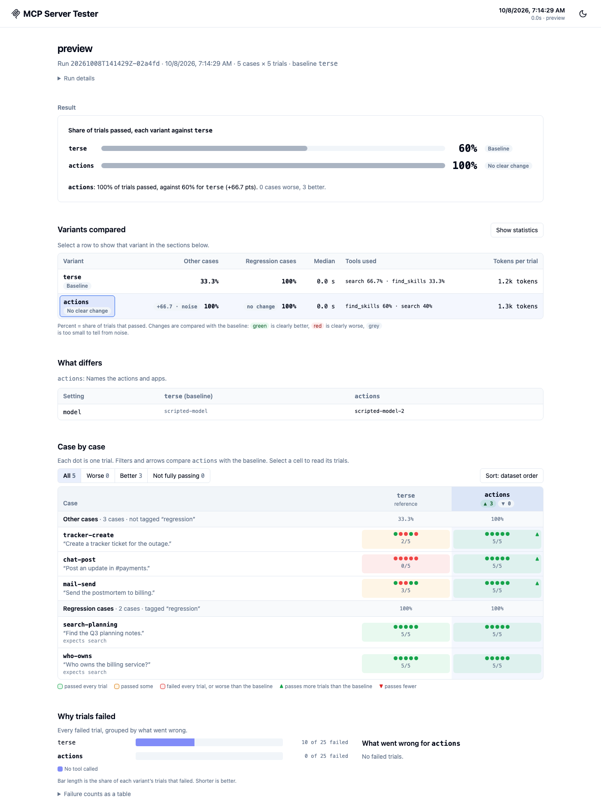

# The Run Report

Every eval run writes a report: an HTML page that answers whether each variant did better or worse than the baseline, and shows every case and trial behind that answer. `mst run` writes one with each run, and so does the MCP Playwright reporter for the evals in a Playwright run. `npx mst open` opens the newest.

The report is for evals. Playwright tests, including direct tool calls and conformance checks, are in Playwright's own report (`['html']`), with their MCP attachments.



## Open a report

```bash
npx mst open                                           # the newest run under .mcp-test-results
npx mst open .mcp-test-results/<eval name>             # that eval's latest run
npx mst open .mcp-test-results/<eval name>/runs/<id>   # one run
npx mst open --print                                   # print the path; don't open a browser
```

A run copied without its `report/` directory gets one written from its files when you open it. See [`mst open`](./cli.md#open---open-a-runs-report).

## What it shows

The sections are the same for every eval:

- **Result:** each variant's share of passing trials next to the baseline's, and whether it's clearly better, clearly worse, or unclear. "Clearly" comes from a paired test over cases, adjusted for the number of variants, so a lucky run isn't called a win.
- **Variants compared:** pass rate (split into regression cases and the rest when cases are tagged `regression`), each judge's mean score, each pairwise judge's win and loss rates, cost per case, median trial time, the tools (or servers) the variant called, and tokens per trial. _Show statistics_ adds 95% ranges, p-values and pass^k.
- **What differs:** the selected variant's setup next to the baseline's: client, model, server labels, client options, input template, judges, and the tool metadata it changes.
- **Case by case:** a dot per trial for every case and variant. Select a cell to read its trials: each grader's score, the trace (tool calls with their inputs and outputs), the answer, and the pairwise preference.
- **Why trials failed:** failed trials grouped by cause (no tool called, the wrong tool, a failed check, an error).

A run with one variant opens on the cases that need attention. A run that optimized tool metadata (`runToolOptimization`) shows the optimization's report first.

**Redaction.** Runs store responses redacted by default (`redactStoredResponses`), so their reports show no answers, tool outputs or judges' reasoning, and say so. Set `redactStoredResponses: false` in the eval config (or the reporter options) to keep them.

## The MCP Playwright reporter

Add it next to Playwright's own reporter:

```typescript
import { defineConfig } from '@playwright/test';

export default defineConfig({
  reporter: [
    ['list'],
    ['html'], // tests and conformance checks
    [
      '@gleanwork/mcp-server-tester/reporters/mcpReporter',
      { name: 'my-server' },
    ], // evals
  ],
});
```

Each Playwright run's eval results (from `runEvalDataset()` and `runEvalCase()`) become one run, written like `mst run`'s: `<outputDir>/<name>/runs/<run-id>/` with the run's files and its report. Each Playwright project is a variant, and the first project in the config is the baseline, so a [`protocolMatrix()`](./protocol-versions.md) compares protocols. Each run is compared with the previous run of the same `name` that ran the same projects.

- **Retries:** a retried test counts once, with its last attempt.
- **Shards:** each shard writes its own run, marked partial (`selection.shard`), which is compared only with the same shard and never becomes the eval's latest. For one run across shards, use Playwright's blob reporter and `merge-reports` with this reporter.
- **Case IDs** name a case's results, so the reporter tells repeats apart: a case two tests ran (one dataset run two ways) is `<id> (<test title>)`, and one ID in two datasets of a test is `<dataset>/<id>`. IDs that differ only in case count as the same. One dataset with the same ID twice stops the run from being written, with an error naming the case.

| Option                  | Default             | What it does                                                                         |
| ----------------------- | ------------------- | ------------------------------------------------------------------------------------ |
| `outputDir`             | `.mcp-test-results` | Where runs are written                                                               |
| `name`                  | `playwright`        | The eval's name: its directory, and what the report calls it                         |
| `autoOpen`              | `false`             | Open the report after the run (never in CI)                                          |
| `quiet`                 | `false`             | No console output                                                                    |
| `redactStoredResponses` | `true`              | Strip answers and tool outputs from the run's files, its report and the result store |
| `resultStore`           | none                | A result store that also gets each run's summary                                     |
| `runMetadata`           | none                | Extra metadata for runs saved to the result store                                    |

`historyLimit`, `includeAutoTracking` and `runId` were removed; passing one fails with what to do instead.

### Result stores

The reporter saves each run's summary to a result store, as `mst run` does:

```typescript snippet=snippets/result-store-reporter-config.ts
import { defineConfig } from '@playwright/test';

export default defineConfig({
  reporter: [
    ['list'],
    [
      '@gleanwork/mcp-server-tester/reporters/mcpReporter',
      {
        outputDir: '.mcp-test-results',
        resultStore: {
          provider: 'gcs',
          bucket: 'my-mcp-eval-results',
          prefix: 'my-server/main',
        },
        runMetadata: {
          branch: process.env.GITHUB_REF_NAME ?? 'local',
          trigger: process.env.GITHUB_EVENT_NAME ?? 'manual',
        },
      },
    ],
  ],
});
```

GCS storage uses Application Default Credentials. Set `GOOGLE_APPLICATION_CREDENTIALS` locally or in CI before running Playwright.

## In CI

Upload the eval's directory and open `runs/<run-id>/report/index.html` from the artifact, or run `npx mst open <run directory>` on the downloaded copy:

```yaml
- uses: actions/upload-artifact@v4
  if: always()
  with:
    name: mcp-eval-runs
    path: .mcp-test-results/
    retention-days: 30
```

Add `.mcp-test-results/` to `.gitignore`.

## Troubleshooting

- **No report was written.** The MCP reporter writes a run only when tests produced eval results; it says so otherwise. Tests without evals are in Playwright's report.
- **The report says "This report has no data."** Its `data.js` is missing: open the run with `npx mst open <run directory>`, which writes it again.
- **No answers in trials.** The run was redacted; see Redaction above.
- **Preview the report while working on it:** `npm run build:ui && npm run preview-reporter` runs a small scripted eval and prints its report's path.

## Next steps

- [Evaluation framework](./evaluation-framework.md): eval configs, variants and what a run leaves behind
- [Assertions](./assertions.md): what graders score
- [CLI](./cli.md): `mst run` and `mst open`
